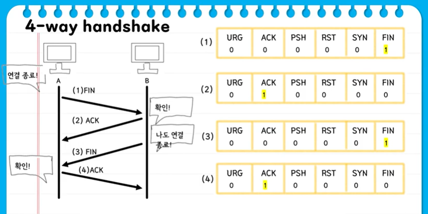

# [TCP] 3 way handshake & 4 way handshake

## 4계층 프로토콜

- 전송 계층(Transport layer)
- 송신자의 프로세스와 수신자의 프로세스를 연결하는 통신 서비스를 제공
- 연결 지향 데이터 스트림 지원, 신뢰성, 흐름 제어, 그리고 다중화와 같은 편리한 서비스 제공
- 연결 지향 전송 방식을 사용하는 전송 제어 프로토콜(TCP)
- 단순한 전송에 사용되는 사용자 데이터그램프로토콜(UDP)

## TCP 프로토콜

- 전송 제어 프로토콜(Transmission Control Protocol)
- 안전한 연결 지향하는 프로토콜
- 인터넷에 연결된 컴퓨터에서 실행되는 프로그램 간에 통신을 안정적으로, 순서대로, 에러없이 교환할 수 있게 함
- TCP는 UDP보다 안전하지만 느림. 체감은 불가능한 정도

# 3 way handshake

**연결 수립 과정**

TCP를 이용한 데이터 통신을 할 때 프로세스와 프로세스를 연결하기 위해 가장 먼저 수행되는 과정

1. 클라이언트가 서버에게 요청 패킷을 보내고
2. 서버가 클라이언트의 요청을 받아들이는 패킷을 보내고
3. 클라이언트는 이를 최종적으로 수락하는 패킷을 보낸다

위의 3가지 과정이 **3Way Handshake** 이다.

- SYN : 동기화 비트
  - 상대방이랑 연결을 시작할 때 무조건 사용하는 플래그
  - 이 비트가 처음 보내지고 나서부터 둘 사이 동기화 됨. 서로 계속 연락
- ACK : 승인 비트
  - 보내도 돼~ / 안돼~

- 이 다음 통신(데이터 송수신)은 클라이언트가 하는데, 다른 누군가가 SYN, ACK 값을 계산해서 서버와 통신하면 다른 누군가와 서버가 통신하게 됨 => 세션 하이재킹

*세션 하이재킹 : 공격자가 인증 작업 등의 완료된 정상적인 통신을 하고 있는 다른 사용자의 세션을 가로채서 별도의 인증 작업을 거치지 않고 가로챈 세션으로 통신을 계속하는 행위

-  TCP의 고유한 취약점을 이용하여 정상적인 접속을 빼앗는 방법
- 서버와 클라이언트에 각각 잘못된 시퀀스 넘버를 사용해서 연결된 세션에 잠시 혼란을 준 뒤 공격자가 끼어 들어가는 방식
- ex) 로그인 한 상태 해킹

**데이터 송수신 과정**

- PSH : 밀어넣기 비트
  - 데이터 밀어넣기

## 4 way handshake

**연결 해제 과정**

데이터 송수신이 완료 후, TCP의 연결을 해제하는 과정

- FIN : 종료 비트
  - 연결 끊음

[참고 자료]

https://www.youtube.com/watch?v=Ah4-MWISel8

https://www.youtube.com/watch?v=gPsSLwaFhYo

https://steady-coding.tistory.com/505

https://github.com/leeda1231/CS/blob/master/%EB%84%A4%ED%8A%B8%EC%9B%8C%ED%81%AC/07.%20%EC%BB%B4%ED%93%A8%ED%84%B0%EC%9D%98%20%ED%94%84%EB%A1%9C%EA%B7%B8%EB%9E%A8%EB%81%BC%EB%A6%AC%EB%8A%94%20%EC%9D%B4%EB%A0%87%EA%B2%8C%20%EB%8D%B0%EC%9D%B4%ED%84%B0%EB%A5%BC%20%EC%A3%BC%EA%B3%A0%20%EB%B0%9B%EB%8A%94%EB%8B%A4.md

https://github.com/leeda1231/CS/blob/master/%EB%84%A4%ED%8A%B8%EC%9B%8C%ED%81%AC/09.%20%EC%97%B0%EA%B2%B0%EC%A7%80%ED%96%A5%ED%98%95%20TCP%20%ED%94%84%EB%A1%9C%ED%86%A0%EC%BD%9C.md