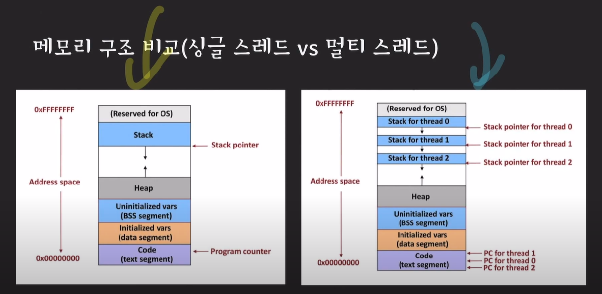

# Process & Thread

**사전 지식**

- 프로그램 (Program)
  - 컴퓨터가 실행할 수 있는 명령어들의 집합

- 프로세스 (Process)
  - 컴퓨터에서 실행 중인 프로그램
  - 각각의 프로세스는 독립된 메모리 공간을 할당 받음
  - 메모리 공간에서 각각의 프로세스에 명령어들과 데이터들을 가짐
- CPU
  - 명령어를 실행하는 연산 장치
- 메인 메모리 (Main Memory)
  - 프로세스가 CPU에서 실행되기 위해 대기하는 곳
- IO (Input/Output)
  - 파일을 읽고 쓰거나
  - 네트워크의 어딘가와 데이터를 주고 받는 것
  - 입출력장치(마우스, 키보드 등) 와 데이터를 주거나 받는 것

**컴퓨터 시스템의 발전 역사**

- 단일 프로세스 시스템

  - 한 번에 하나의 프로그램만 실행됨
  - 단점
    - CPU 사용률이 좋지 않음 - IO 작업을 하는 동안 CPU는 놀고 있음

  

=> 여러 개의 프로그램을 메모리에 올려놓고 동시에 실행시키자!

=> IO 작업이 발생하면 다른 프로세스가 CPU에서 작업한다

- 멀티프로그래밍 : CPU 사용률을 극대화시키는데 있음
  - 단점
    - CPU 사용시간이 길어지면 다른 프로세스는 계속 대기

=> 프로세스는 한번 CPU를 사용할 때 아주 짧은 시간(=quantum)만 CPU에서 실행되도록 하자!

- 멀티태스킹 : 프로세스의 응답 시간을 최소화 시키는데 목적 (클라이언트 입장에서는 마치 여러 프로그램이 동시에 돌아가는것 처럼 보임)

아쉬운 점

=> 하나의 프로세스가 동시에 여러 작업을 수행하지는 못함

=> 프로세스의 컨텍스트 스위칭은 무거운 작업

=> 프로세스끼리 데이터 공유가 까다로움 (각각 독립적인 메모리 공간을 가지고 있기 때문)

=> 듀얼 코어(한 CPU안에 2개의 코어)가 등장했는데 잘 쓰고 싶음 

*Context Switching : 동작 중인 프로세스가 대기하면서 해당 프로세스의 상태를 보관하고, 대기하고 있던 다음 순번의 프로세스가 동작하면서 이전에 보관했던 프로세스 상태를 복구하는 과정

해결책

=> 스레드!!

**스레드 (Thread)**

- 프로세스는 한 개 이상의 스레드 가질 수 있다 (하나의 프로세스에서 여러 작업을 수행하기 위함)
- CPU에서 실행되는 단위 - unit of execution (옛날에는 프로세스였음)
- 같은 프로세스의 스레드들끼리 컨텍스트 스위칭을 가볍다
- 자신들이 속한 프로세스의 메모리 영역을 공유
  - 데이터 공유 쉬움

- 멀티 스레드
  - 스레드마다 고유의 영역 있음 (Stack)
  - 공유하는 Heap 영역 있음

- 멀티 스레딩 : 하나의 프로세스가 동시에 여러 작업을 실행하는 데 목적
- 확장된 멀티태스킹 : 여러 프로세스와 여러 스레드가 아주 짧게 쪼개진 cpu time을 나눠 갖는 것
- 멀티 프로세싱 : 두 개 이상의 프로세서나 코어를 활용하는 시스템

[참고]

https://www.youtube.com/watch?v=QmtYKZC0lMU