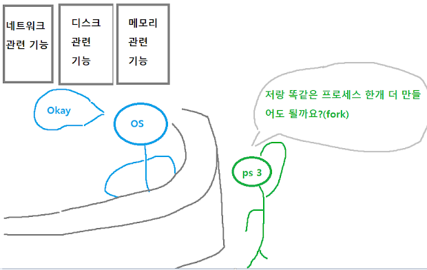
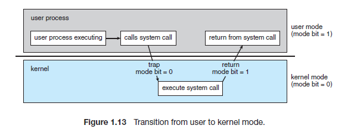

# System Call

## 1. 시스템 콜이란?

**시스템 콜**

: 프로그램이 OS 커널이 제공하는 서비스를 이용하고 싶을 때 시스템 콜을 통해 실행

ex) 프로세스가 컴퓨터를 관리하는 시스템(System)인 운영체제에게 어떤 기능(서비스)를 사용하게 해달라고 요청(call) 할 때

```txt
1. 컴퓨터 대부분 활동은 운영체제를 통해 실행 및 관리가 된다.
2. 실행중인 프로세스가 자신의 프로그램 외 특정 파일 데이터를 필요로 한다.
3. 파일을 읽고, 메모리에 데이터를 올리는 것은 운영체제의 역할이기 때문에 운영체제에게 허락을 요청(call)한다.
=> 운영체제가 관리하는 모든 자원(네트워크, 디스크, 메모리 등)을 프로세스가 필요로 할 경우 시스템 콜을 사용해야 한다.
```




- 시스템 콜들은 실제로 운영체제에서 만들어놓은 코드들(함수)
- 프로그래밍을 할 때 시스템 콜이 들어있는 헤더파일을 불러와서 사용한다
- 현대 운영체제들은 보통 수백개의 시스템콜들을 가지고 있다


**자세히**



1. User mode 

- 우리가 개발하는 프로그램은 일반적으로 유저 모드에서 실행

2. User mode-> Kernel mode 

- 프로그램 실행 중에 인터럽트(interrupt)가 발생하거나 시스템 콜(system call)을 호출하게 되면 커널 모드로 전환

3. Kernel mode 

- 우선 방금 전까지 실행중이었던 프로그램의 현재 CPU 상태를 저장함

- 커널이 인터럽트나 시스템 콜을 직접 처리. 즉, CPU에서 커널 코드가 실행됨

- 처리가 완료되면 중단됐던 프로그램의 CPU 상태를 복원

4. Kernel mode -> User mode

- 다시 통제권을 프로그램에게 반환

5. User mode

- 프로그램이 이어서 실행


**커널(Kernel)**

- 운영체제의 핵심
- <u>시스템의 전반을 관리/감독하는 역할</u>
- 하드웨어와 관련된 작업을 직접 수행


**커널 모드(Kernel mode)를 쓰는 이유**

- 시스템을 보호하기 위해
  - 없을 시, 우리가 개발한 프로그램이 함부로 하드웨어를 점유해서 사용해 다른 프로세스에 영향을 끼칠 수 있음


## **2. 종류**

- 프로세스/스레드 관련
- 파일 I/O 관련
- 소켓 관련
- 장치(device) 관련
- 프로세스 통신 관련

```txt
- 프로세스 컨트롤
프로세스 생성 및 종료 / 메모리에 로드, 실행 / 프로세스 속성 값 확인, 지정/ wait 이벤트, signal 이벤트 / 메모리 할당
- 파일 매니지먼트
파일 생성, 파일 삭제 / 열기, 닫기 / 읽기, 쓰기, Reposition / 파일 속성 값 확인, 지정
- 디바이스 매니지먼트
디바이스 요청 및 해제 / 읽기, 쓰기, Reposition / 디바이스 속성 확인, 지정 / 비 물리적인 디바이스 해제 및 장착
- 정보 관리
시간 확인, 시간 지정 / 시스템 데이터 확인, 지정 / 프로세스, 파일, 디바이스 속성 가져오기 /프로세스, 파일, 디바이스 속성 설정하기
- 통신
커뮤니케이션 연결 생성 및 삭제 / 메시지 송신, 수신 / 상태 정보 전달 / remote 디바이스 해제 및 장착
- 보안
Permission 획득 / Permission 설정
```

=> 시스템 콜이 발생하면 해당 커널 코드가 커널 모드에서 실행


**[참고 자료]**

https://mamu2830.blogspot.com/2021/01/whatIsSystemCall.html

https://www.youtube.com/watch?v=v30ilCpITnY

https://fjvbn2003.tistory.com/306