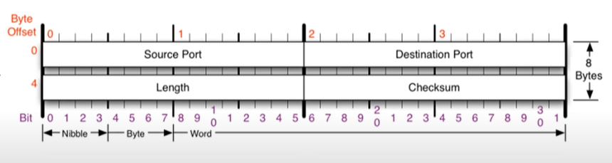

# UDP

## UDP란?

- 전송 계층(Transport layer)
- 단순한 전송에 사용되는 사용자 데이터그램 프로토콜(User Datagram Protocol)
- 비연결지향형 프로토콜
  - 연결되든 말든 일단 데이터 던짐

## 구조

## 특징

- 연결 유무 x
- 순서 보장 x
- 송신 보장 x
- 전송 방식이 너무 단순해서, 서비스의 신뢰성이 낮고, 데이터그램 도착 순서가 바뀌거나, 중복되거나, 심지어는 통보 없이 누락시키기도 한다.
- 대신 빠르다.
- 데이터 유실이 보통 7% 정도 일어남 => 일반적으로 오류의 검사와 수정이 필요 없는 프로그램에서 수행할 것

## 사용하는 곳

- DNS 서버
  - 도메인을 물으면 IP주소 알려준다.
- 게임
  - 즉각 반응이 빨라야 하기 때문

*Reliable UDP

: TCP의 HW에서 하던 일을 SW에서 함. Unity, Unreal 등에서 제공