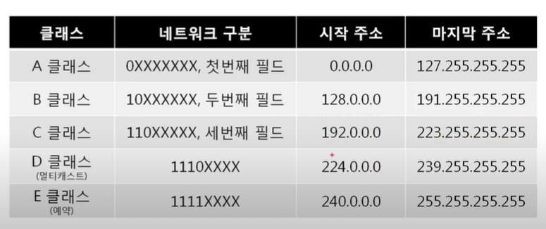
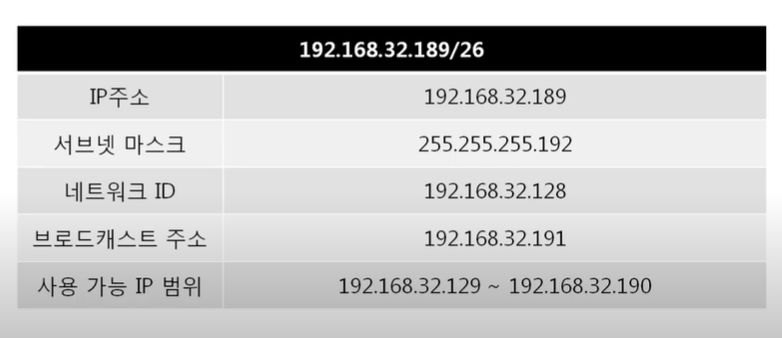

- 3계층

  **다른 네트워크 대역** 즉, 멀리 떨어진 곳에 존재하는 네트워크까지 어떻게 데이터를 전달할지 제어하는 일 담당 

  발신에서 착신까지 패킷의 경로를 제어

  

  - IP주소

    WAN에서 통실할 때 사용하는 주소

    - IPv4 주소: 현재 PC에 할당된 IP 주소

    - 서브넷 마스크: IP주소에 대한 네트워크 대역을 규정하는 것 

    - 기본 게이트웨이: 외부와 통신할 때 사용하는 네트워크 출입구

      

  - 3계층 프로토콜

    - ARP 프로토콜: IP주소를 이용해 MAC주소를 알아옴
    - IPv4 프로토콜: WAN에서 통신할 때 사용
    - ICMP 프로토콜: 서로 통신되는 지 확인할 때 사용

- IP 주소

  - 일반

    - Classful 주소

      *낭비가 심함*

      

      

    - Classfulless IP 주소

      *아껴씀*

      

      - 서브넷 마스크

        클래스풀한 네트워크 대역을 나눠주는데 사용하는 값

        

    - 사설 IP와 공인 IP - 공인 IP 1개당 2^32개의 사설 IP

      - 실제 인터넷에서는 공인IP로만 통신 

        외부 네트워크 대역에서는 사설 IP대역이 보이지 않음

        

  - 특수

    - 0.0.0.0 - 나머지 모든 IP
    - 127.0.0.1 - 나 자신
    - 게이트웨이 주소