전체영상: [네트워크 기초(개정판)](https://www.youtube.com/playlist?list=PL0d8NnikouEWcF1jJueLdjRIC4HsUlULi)

### [네트워크란?](https://youtu.be/Av9UFzl_wis?list=PL0d8NnikouEWcF1jJueLdjRIC4HsUlULi)

## 네트워크란 무엇인가?

### 네트워크란?

네트워크란 노드들이 데이터를 공유할 수 있게 하는 디지털 전기통신망의 하나이다.

즉, 분산되어 있는 컴퓨터를 통신망으로 연결한 것을 말한다.

네트워크에서 여러 장치들은 노드 간 연결을 사용하여 서로에게 데이터를 교환한다.

> 노드 : 네트워크에 속한 컴퓨터 또는 통신 장비를 뜻하는 말

### 인터넷이란?

문서, 그림, 영상과 같은 여러가지 데이터를 공유하도록 구성된

세상에서 가장 큰, 전세계를 연결하는 **네트워크**

> 흔히 www를 인터넷으로 착각하는 경우가 많은데, www는 인터넷을 통해 웹과 관련된 데이터를 공유하는 것

---

## 네트워크의 분류

### 크기에 따른 분류

- LAN

  - 가까운 지역을 하나로 묶은 네트워크 (근거리 통신망)
  - ex) PC방에서 친구와 스타를 LAN UDP로
  - 랜선!

- WAN

  - 멀리 있는 지역을 한데 묶은 네트워크

  - 가까운 지역끼리 묶인 LAN과 LAN을 다시 하나로 묶은 것

    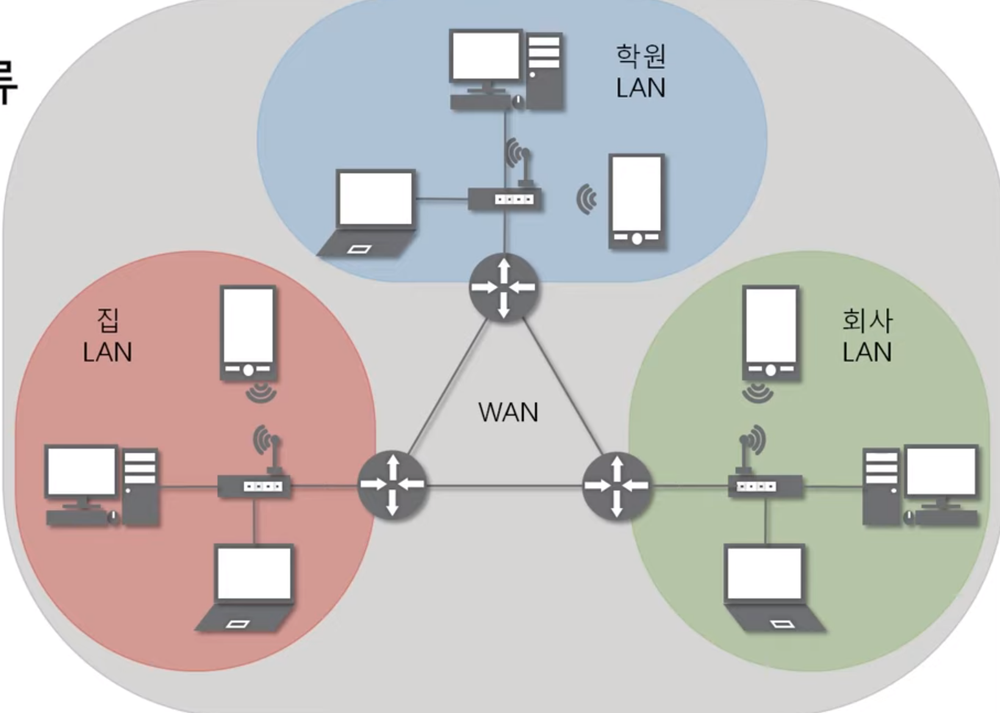

### 연결 형태에 따른 분류

#### Star 형 - 중앙 장비에 모든 노드가 연결됨

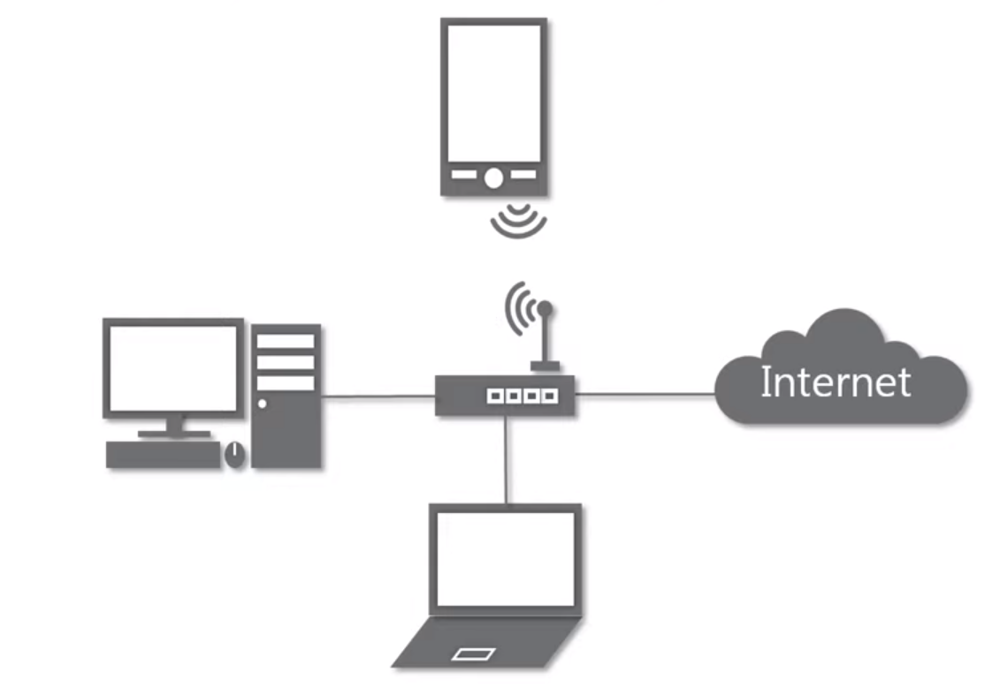

- 일반적으로 가정집에서는 공유기를 통해서 핸드폰, 컴퓨터, TV 등이 연결된다. 이 때 공유기가 고장난다면? 다 못써..
- 이런 경우를 Star 형이라고 한다.

#### Mesh형 - 여러 노드들이 서로 그물처럼 연결됨

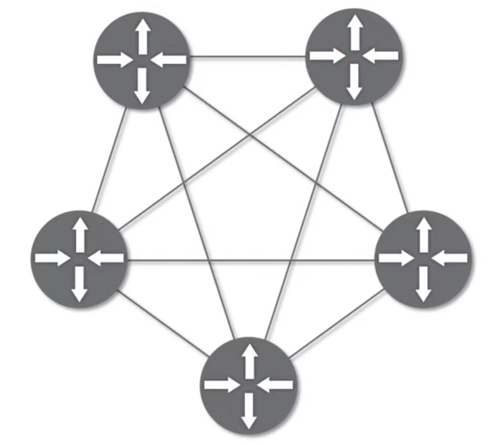

- 하나가 고장나더라도 다른 통신망은 그대로 살아있음
- 멀리 떨어져있는 대역을 연결하는 데 사용
  - ex) 우리나라와 다른 나라를 연결

#### 혼합형 - 실제 인터넷은 여러 형태를 혼합한 형태

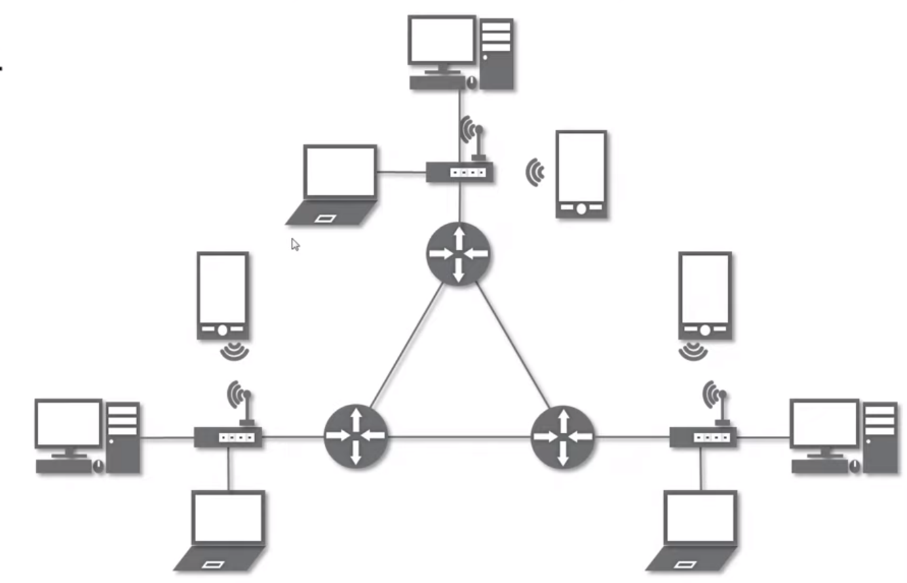

----

## 네트워크의 통신 방식

### 네트워크에서 데이터는 어떻게 주고받는가?

---

## 네트워크 프로토콜

### 프로토콜이란?

프로토콜은 일종의 약속, 양식

네트워크에서 노드와 노드가 통신할 때 어떤 노드가 어느 노드에게 어떤 데이터를 어떻게 보내는지 작성하기 위한 양식

택배, 편지, 전화는 각각의 양식이 다 따로 있다.

각 프로토콜들도 이와 같이 해당 프로토콜의 양식이 있다.

### 여러가지 프로토콜

여러가지 상황에 따라 그에 맞는 양식의 프로토콜을 사용한다.

앞으로 이 프로토콜들을 하나하나 사용해 볼 것.

#### 패킷

- 여러 프로토콜들이 하나로 합쳐진 것을 **캡슐화** 라고 한다.

---

## 따라하기

### [실습1 (tracert)](https://youtu.be/paJf7JbBWqY?list=PL0d8NnikouEWcF1jJueLdjRIC4HsUlULi)

### 1. 구글과 나는 어떻게 연결되어 있는지 확인해보기

구글의 서버와 여러분의 컴퓨터가 어떻게 연결되어 있는지 확인해보기

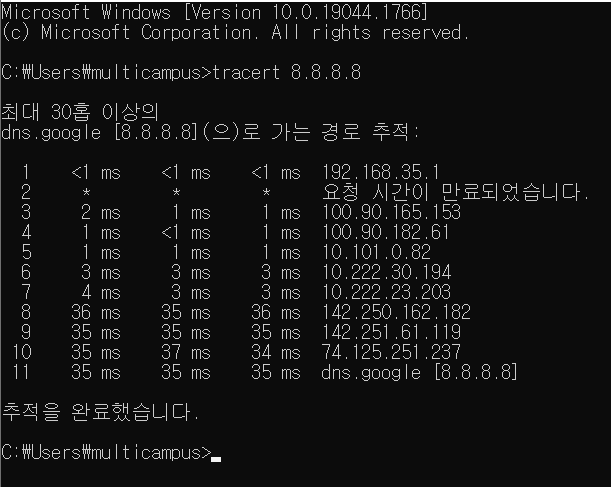

바다 건너 google 서버까지 가기 위해 거쳐간 네트워크들을 보여주는 것.

*은 공개하지 않는 것.

바다 건너 google까지 갈 때 11개의 네트워크를 거쳐갔다는 뜻

### [실습2 (Wireshark)](https://youtu.be/vBrQ3yzerMg?list=PL0d8NnikouEWcF1jJueLdjRIC4HsUlULi)

### 2. Wireshark 설치

프로토콜이 어떻게 생겼는지 직접 보기 위해 사용할 프로그램을 설치

### 3. 프로토콜 직접 보기

설치한 Wireshark를 이용해서 현재 컴퓨터에서 인터넷을 통해 주고받고 있는 모든 내용을 직접 확인해보기

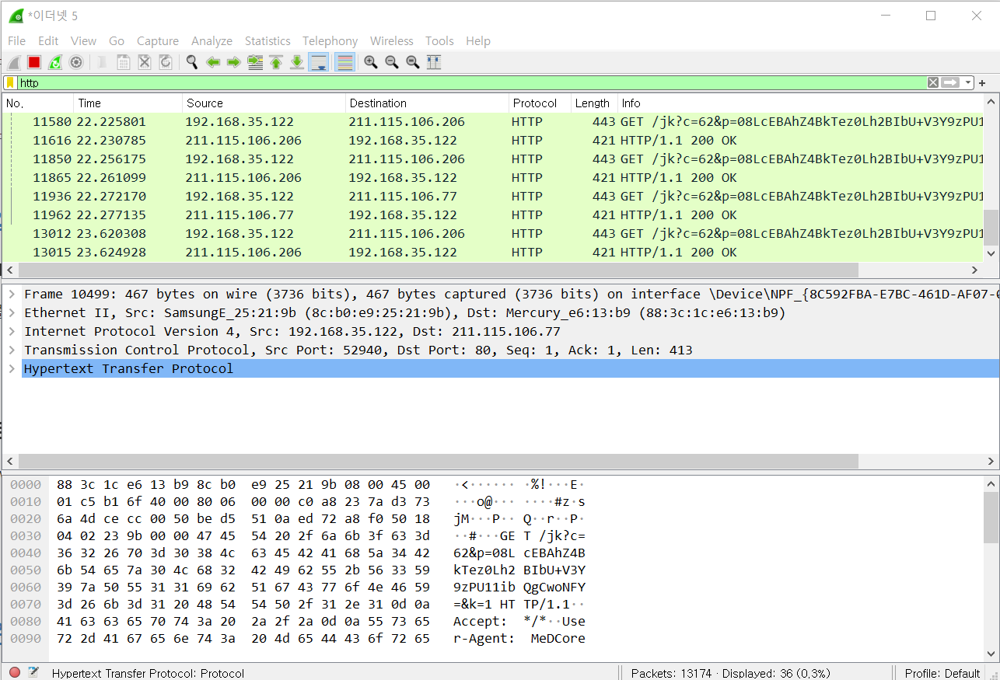

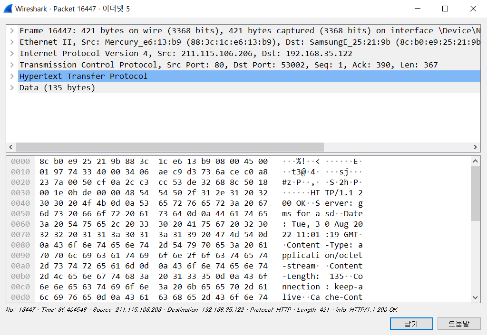

---

---

### [네트워크 모델](https://youtu.be/y9nlT52SAcg?list=PL0d8NnikouEWcF1jJueLdjRIC4HsUlULi)

## 네트워크 모델의 종류

### TCP/IP 모델

1960년대 말 미국방성의 연구에서 시작되어

1980년대 초 프로토콜 모델로 공개

현재의 인터넷에서 컴퓨터들이 서로 정보를 주고받는데 쓰이는 통신 규약(프로토콜)의 모음이다.

### OSI 7계층 모델

1984년 네트워크 통신을 체계적으로 다루는 ISO에서 표준으로 지정한 모델

데이터를 주고받을 때 데이터 자체의 흐름을 각 구간별로 나누어 놓은 것

> 네모로 체크해 놓은 건 중요해!

---

## 두 모델 비교

### 공통점과 차이점

- 공통점
  - 계층적 네트워크 모델
  - 계층간 역할 정의
- 차이점
  - 계층의 수 차이
  - OSI는 역할 기반, TCP/IP는 프로토콜 기반
  - OSI는 통신 전반에 대한 표준
  - TCP/IP는 데이터 전송기술 특화

실제 네트워크에서는 TCP/IP모델에 더 가깝다

---

## 네트워크를 통해 전달되는 데이터, 패킷

### 패킷이란?

패킷이란 네트워크 상에서 전달되는 데이터를 통칭하는 말로, 네트워크에서 전달하는 데이터의 형식화된 블록이다.

패킷은 제어 정보와 사용자 데이터로 이루어지며 사용자 데이터는 페이로드라고 한다.

러시아 전통 인형처럼 바깥과 안쪽을 구분하여 패킷을 만든다. 즉, 패킷 프로토콜에도 순서가 있다.

- 페이로드 : 실제로 내가 보내려고 하는 데이터
- 헤더, 풋터 : 붙이는 것
  - 일반적으로 풋터는 사용하지 않음

#### 여러 프로토콜들로 캡슐화 된 패킷

HTTP를 페이로드로 해서 TCP라는 헤더를 붙인다.

HTTP + TCP를 페이로드로 해서 IPv4를 헤더로 붙인다.

여기서 다시 HTTP + TCP + IPv4를 페이로드로 해서 Ethernet을 헤더로 붙인다.

### 패킷을 이용한 통신과정

#### 여러 프로토콜을 이용해서 최종적으로 보낼 때 패킷을 만드는 과정 - 캡슐화

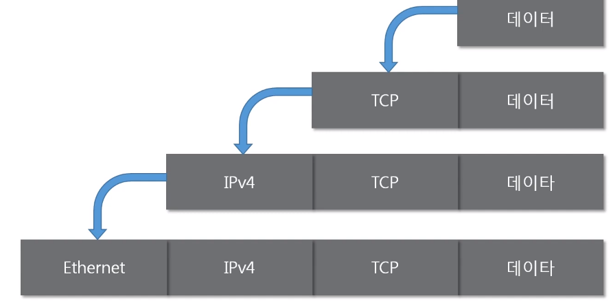

데이터를 보낼 때 프로토콜을 하나씩 붙이는 과정을 캡슐화라고 한다.

상위 계층에서 하위 계층으로 내려가면서 프로토콜을 붙인다.

프로토콜을 붙일 때, 하위 프로토콜 앞에 상위 프로토콜이 올 수 없다.

#### 패킷을 받았을 때 프로토콜들을 하나씩 확인하면서 데이터를 확인하는 과정 - 디캡슐화

캡슐화와 반대 순서로 진행한다.

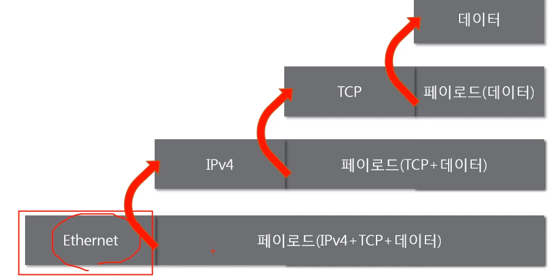

뒤쪽은 데이터만 남을 때까지 계속해서 페이로드이다.

### 계층별 패킷의 이름 PDU

- 4계층의 PDU : 세그먼트

- 3계층의 PDU : 패킷

- 2계층의 PDU : 프레임

## 따라하기

### 프로토콜의 캡슐화 된 모습과 계층별 프로토콜들을 확인해보기

Wireshark를 이용하여 패킷을 캡쳐해보고 해당 패킷이 어떻게 캡슐화 되었는지 자세히 살펴본다.

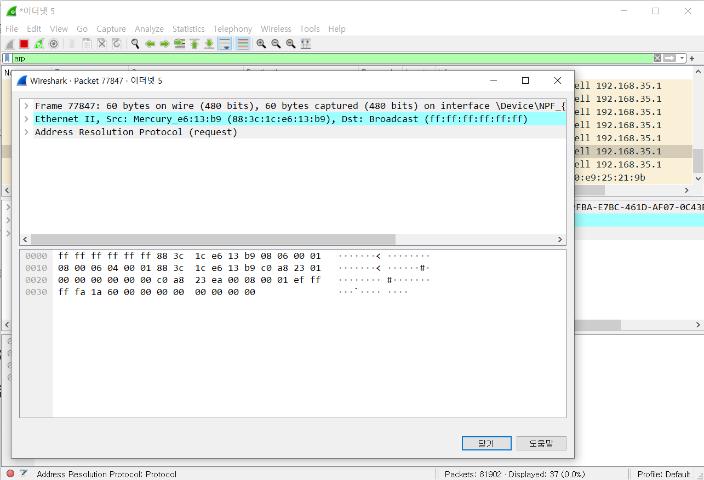

뒤에 붙은 건 푸터!

가운데에 있는 게 arp 프로토콜
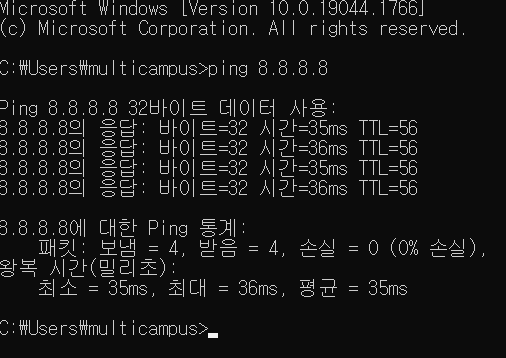

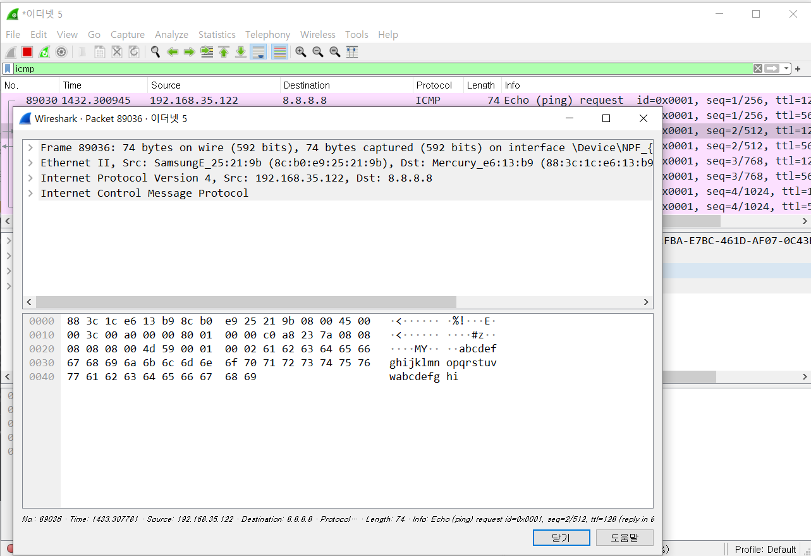

아래 0000, 0010, 0020, 0030, 0040이 각각 프로토콜