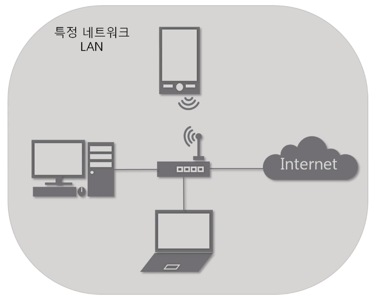
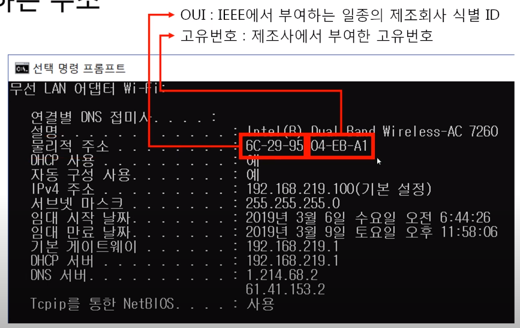
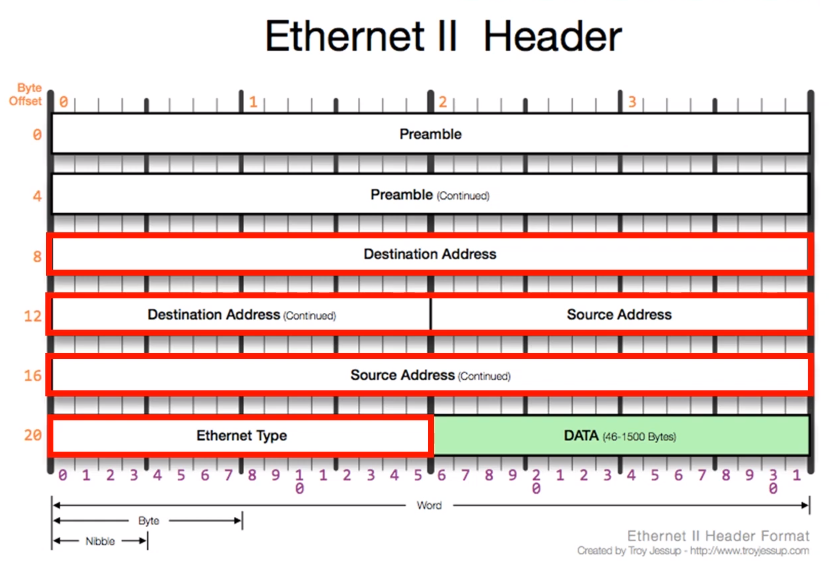
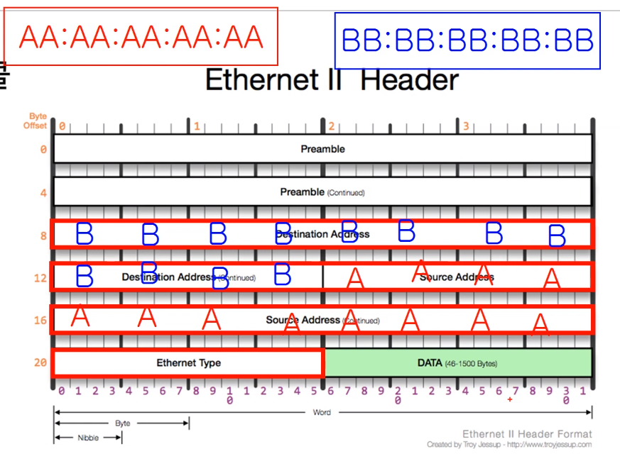
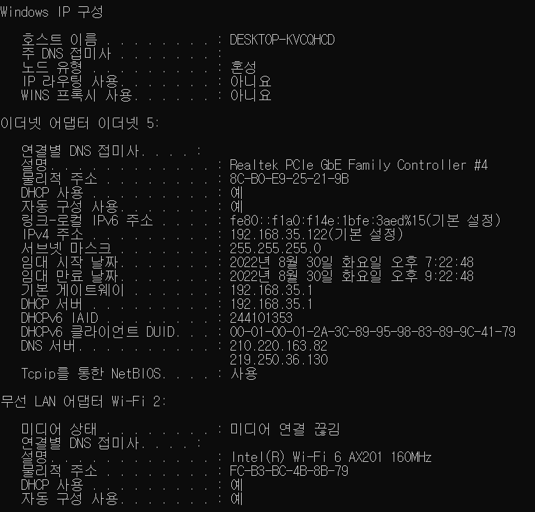
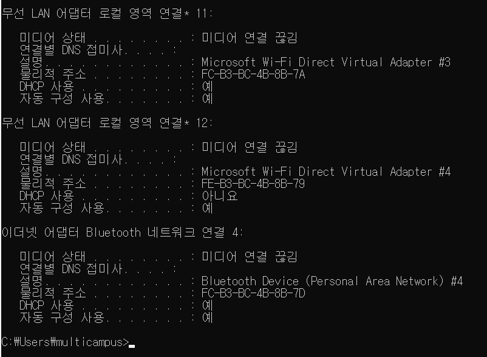
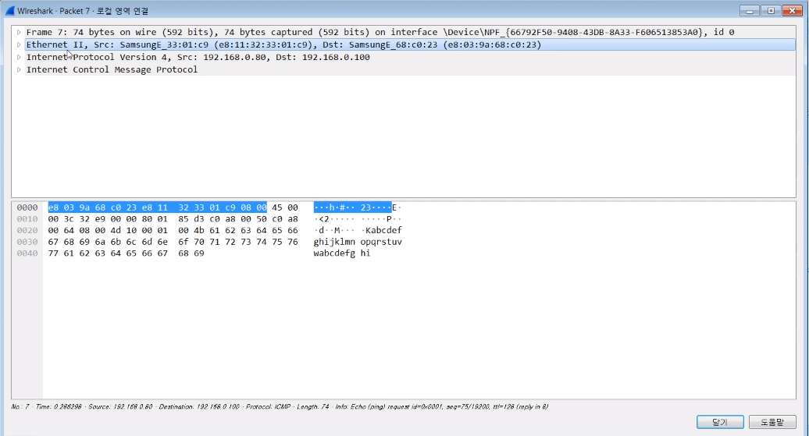
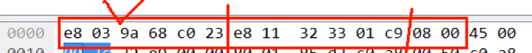
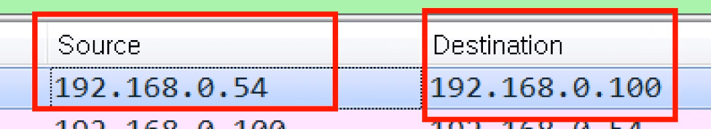
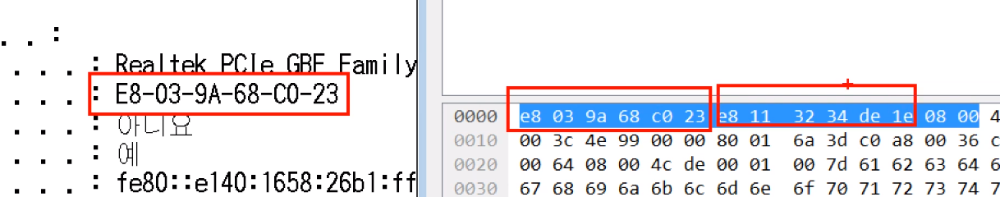

# 가까이 있는 컴퓨터끼리는 이렇게 데이터를 주고받는다

영상: [[따라學IT] 03. 가까이 있는 컴퓨터끼리는 이렇게 데이터를 주고받는다](https://youtu.be/HkiOygWMARs?list=PL0d8NnikouEWcF1jJueLdjRIC4HsUlULi)

## 2계층에서 하는 일

### 2계층의 기능

2계층은 하나의 네트워크 대역 즉, 같은 네트워크 상에 존재하는 여러 장비들 중에서 어떤 장비가 어떤 장비에게 보내는 데이터를 전달

추가적으로 오류제어, 흐름제어 수행

### 2계층의 네트워크 크기

2계층은 하나의 네트워크 대역 LAN에서만 통신할 때 사용한다.

다른 네트워크와 통신할 때는 항상 3계층이 도와주어야 한다.

3계층의 주소와 3계층의 프로토콜을 이용하여만 다른 네트워크와 통신이 가능하다.

---

## 2계층에서 사용하는 주소

### 물리적인 주소

#### MAC 주소 - LAN에서 통신할 때 사용

16진수로 쓴다.

---

## 2계층 프로토콜

### Ethernet 프로토콜 - LAN에서 통신할 때 사용

- Destination Address, Source Address, Ethernet Type 부분을 알면 된다.
- Destination Address : 6byte
  - 이더넷 프로토콜의 목적지 MAC 주소
- Source Address : 6byte
  - 이더넷 프로토콜의 출발지 MAC 주소
- Ethernet Type
  - 프로토콜 타입
  - 데이터 안에 들어있는 상위 프로토콜을 알려주는 역할

출발지와 도착지 주소가 이러한 방식으로 들어간다.

---

## 따라하기

### 1. 내 MAC 주소 알아보기

윈도우에서 간단하게 내 PC의 MAC 주소를 확인하는 방법 알아보기

### 2. Ethernet 프로토콜 캡쳐

Ethernet 프로토콜이 어떻게 생겼는지 직접 보기 위해 Wireshark를 이용해 캡쳐해보기

### 3. Ethernet 프로토콜 분석

캡쳐한 Ethernet 프로토콜에 내 MAC 주소가 있는지 목적지는 어디인지 분석해보기

앞 6byte, 뒤 6byte, 상위 프로토콜 타입

출발지와 목적지

도착지 / 목적지를 확인할 수 있음

08 00 이므로 IPv4가 상위 프로토콜이다.