# 4장 - IP 주소

### 실제로 컴퓨터끼리는 IP주소를 사용해 데이터를 주고받는다.

## 3계층의 기능

### 3계층에서 하는 일

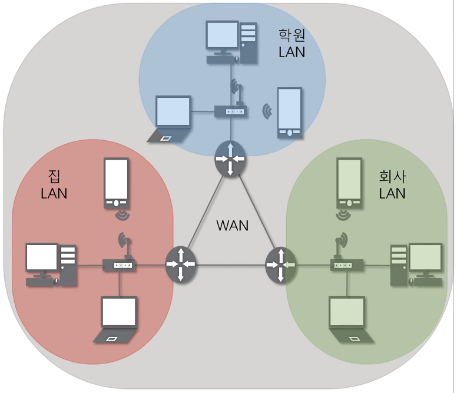

3계층은 다른 네트워크 대역 즉, 멀리 떨어진 곳에 존재하는 네트워크까지 어떻게 데이터를 전달할지 제어하는 일을 담당

발신에서 착신까지의 패킷의 경로를 제어

### 3계층에서 쓰는 주소

#### IP주소

- WAN에서 통신할 때 사용한다.

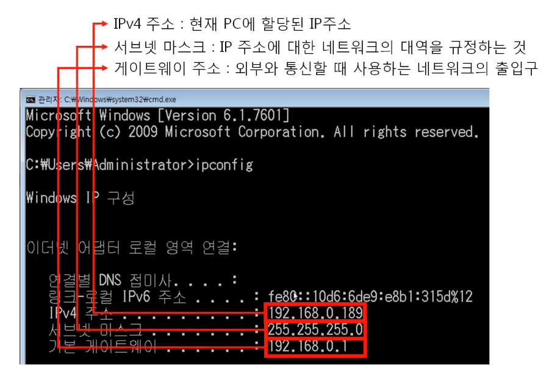

- IPv4 주소 : 현재 PC에 할당된 IP주소
- 서브넷 마스크 : IP 주소에 대한 네트워크의 대역을 규정하는 것
- 게이트웨이 주소 : 외부와 통신할 때 사용하는 네트워크의 출입구

### 3계층 프로토콜

#### ARP 프로토콜

- IP주소를 이용해 MAC 주소를 알아온다.

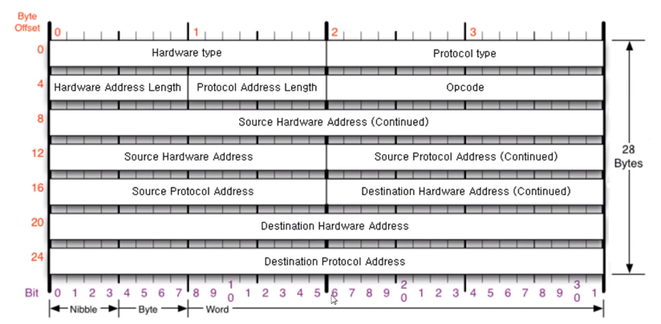

#### IPv4 프로토콜

- WAN에서 통신할 때 사용한다.

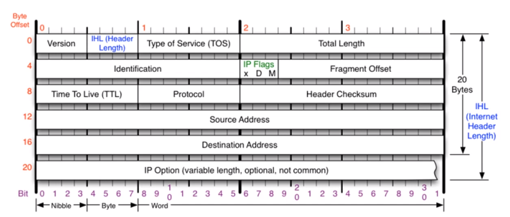

#### ICMP 프로토콜

- 서로가 통신되는지 확인할 때 사용한다.

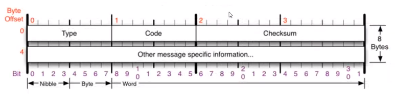

---

## 일반적인 IP 주소

### Classful IP 주소

- 낭비가 심하다

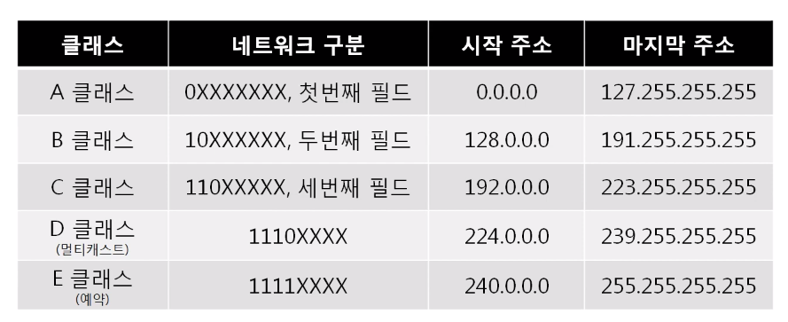

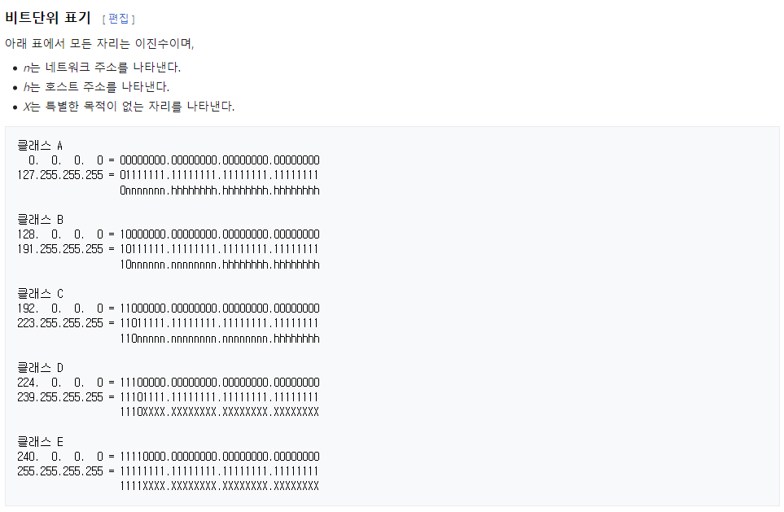

### Classless

- 낭비되지 않도록 아껴쓴다.

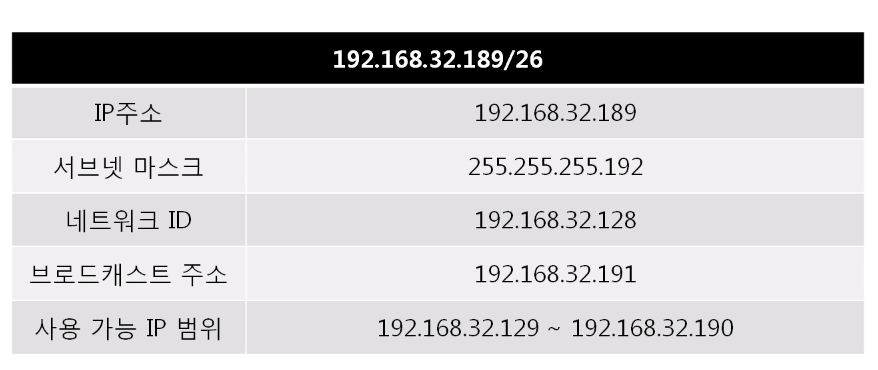

- 인터넷이 상용화 되며 폭발적으로 증가한 사용량에 따른 IP 주소 부족을 해결하기 위한 방법.
- Classful 에서는 한 개의 클래스 네트워크가 한 조직에 할당 되면 안쓰는 주소라도 다른 주소를 사용하기 어려워 클래스라는 개념을 버렸다.
- Classless 네트워크에서는 별도로 네트워크와 호스트 주소를 나누는 구분자를 사용하는데 이것을 `서브넷 마스크` 라고 한다.

#### 서브넷 마스크

클래스풀한 네트워크 대역을 나눠주는 데에 사용되는 값. 어디까지가 네트워크 대역을 구분하는 데에 사용하고 어디서부터 호스트를 구분하는데 사용하는지를 지정한다.

2진수로 표기했을 때 1로 시작, 1과 1사이에는 0이 올 수 없다는 규칙을 가지고 있다.

### 사설IP와 공인IP

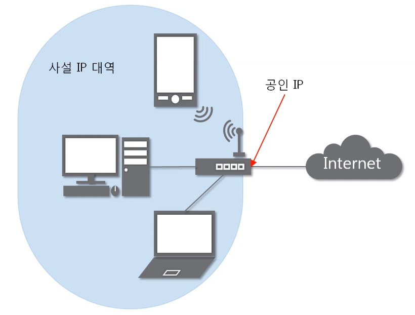

공인IP 한 개당 2^32개의 사설IP가 존재한다.

- 실제 일반적인 네트워크의 모습은 아래와 같다.

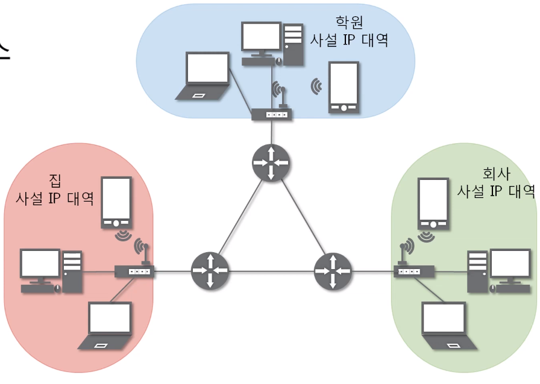

- 실제 인터넷 세상에서는 공인IP로만 통신한다.
- 외부 네트워크 대역에서는 사설IP 대역이 보이지 않는다.

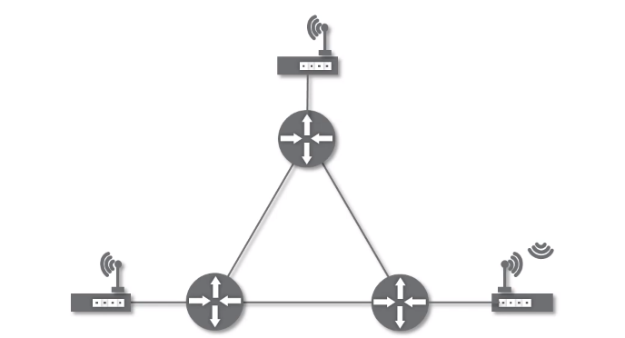

---

## 특수한 IP 주소

### 0.0.0.0

- Wildcard
- 유효하지 않거나 알 수 없거나 적용할수 없는 대상을 지정하는 데 사용되는 라우팅 할 수 없는 메타 주소.
- 클라이언트 또는 서버와 같은 여러 컨텍스트에서 특정 의미가 할당된다.

### 127.X.X.X

- 나 자신을 나타내는 주소

### 게이트웨이 주소

- 컴퓨터 네트워크에서 서로 다른 통신망, 프로토콜을 사용하는 네트워크 간의 통신을 가능하게 하는 컴퓨터나 소프트웨어를 두루 일컫는 용어.
- 다른 네트워크로 들어가는 입구 역할을 한다.