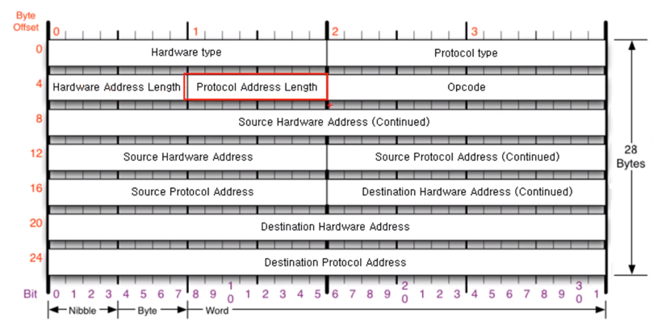
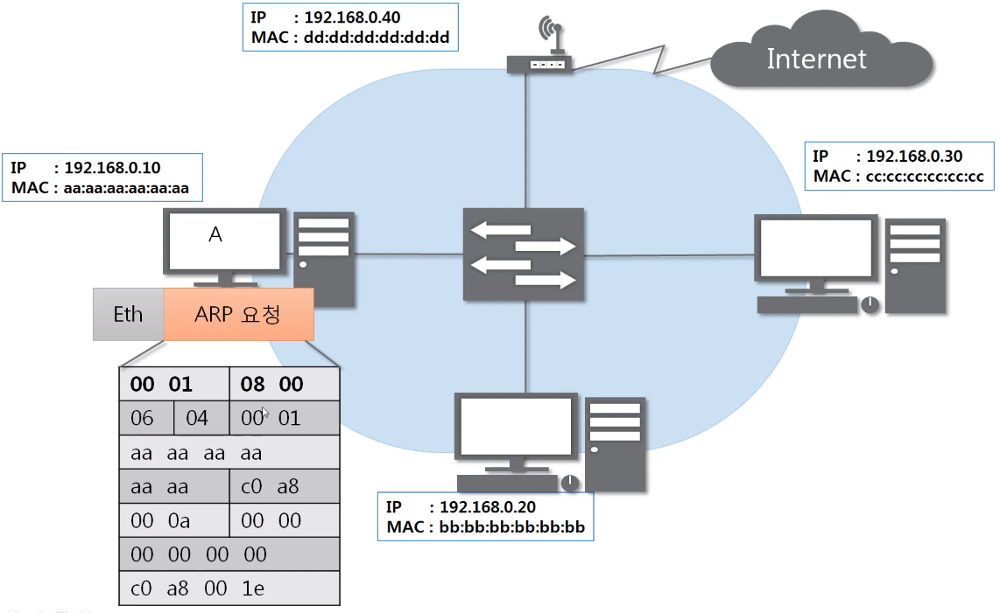
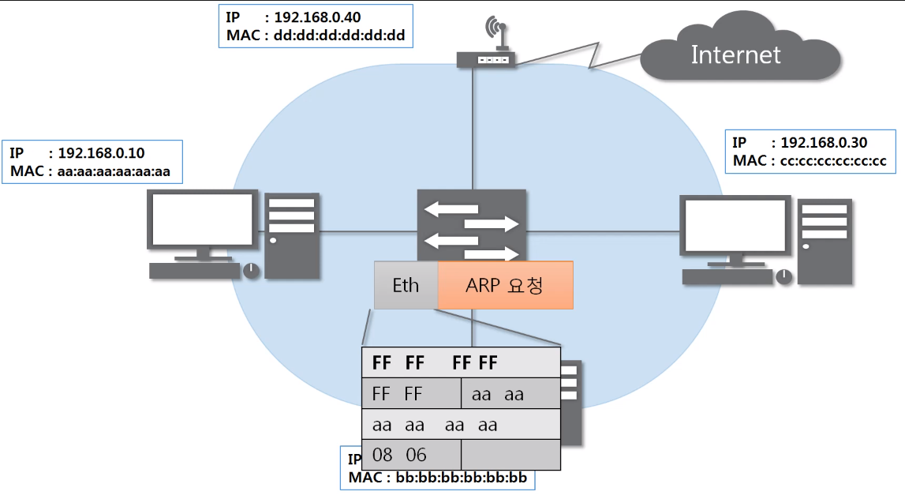
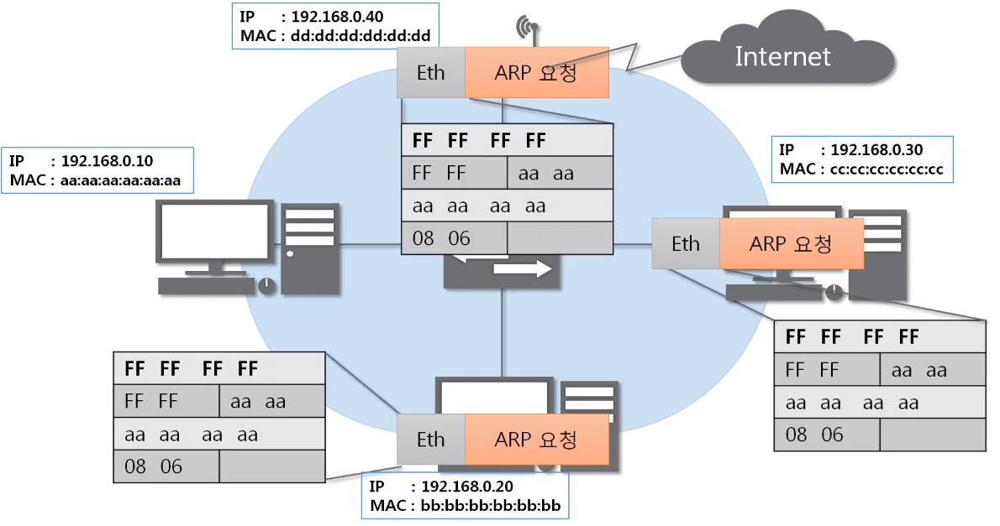
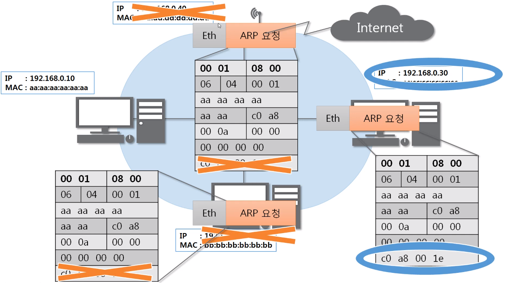
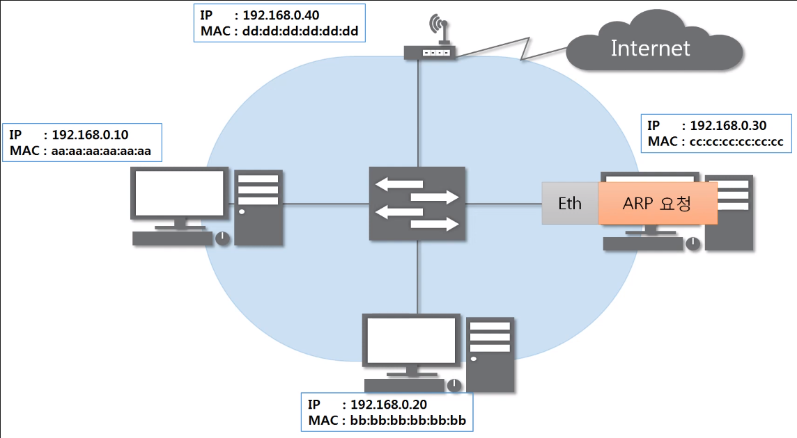
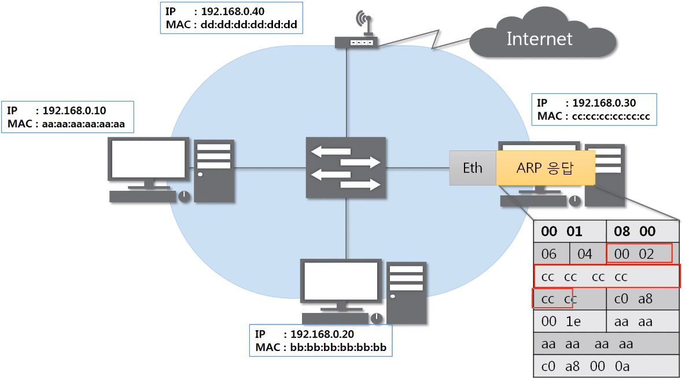
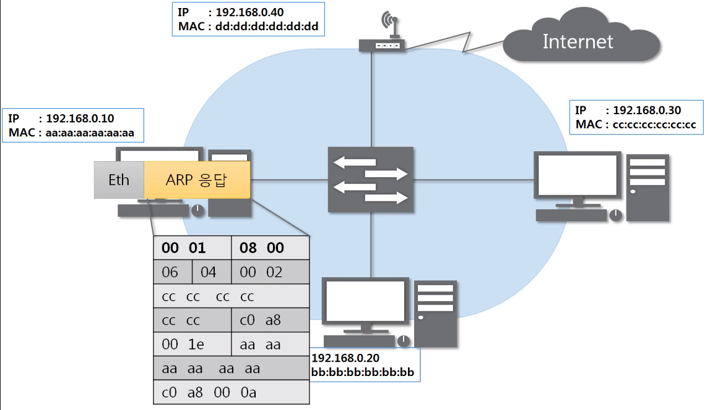
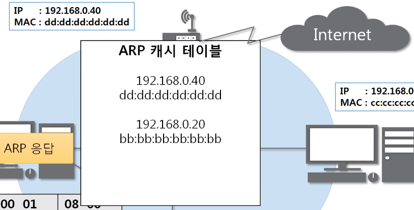

# 통신하기 전 반드시 필요한 ARP 프로토콜

## ARP 프로토콜

### ARP가 하는 일

ARP 프로토콜은 같은 네트워크 대역에서 통신을 하기 위해 필요한 MA 주소를 IP주소를 이용해서 알아오는 프로토콜이다.

같은 네트워크 대역에서 통신을 한다고 하더라도 데이터를 보내기 위해서는 7계층부터 캡슐화를 통해 데이터를 보내기 때문에 IP주소와 MAC주소가 모두 필요하다.

이 때 IP주소는 알고 MAC주소는 모르더라도 ARP를 통해 통신이 가능하다.

### ARP 프로토콜의 구조

- IP주소를 이용해 MAC주소를 알아온다.

---

## ARP 프로토콜의 통신 과정

### IP 주소로 MAC 주소를 알아오는 과정

#### 1. ARP 요청 - 1

### 2. ARP 요청 - 2

### 3. ARP 요청 - 3

#### 4. ARP 요청 - 4

### 5. ARP 응답 - 1

#### 6. ARP 응답 - 2

## ARP 테이블

### 나와 통신했던 컴퓨터들

- 통신했던 컴퓨터들의 주소는 ARP 테이블에 남는다.

