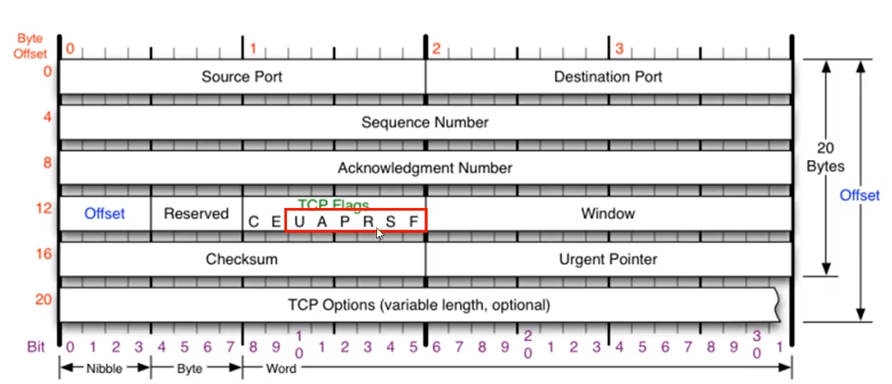
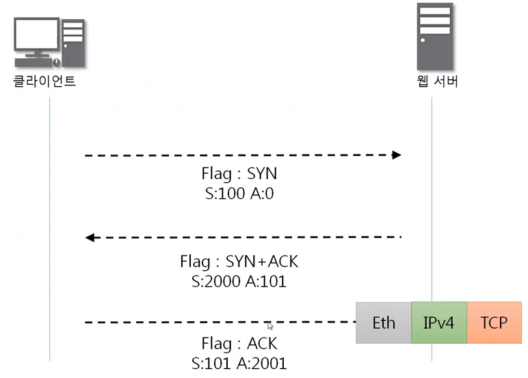
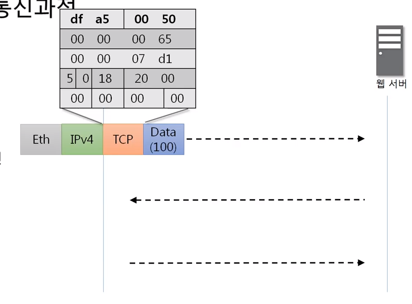

# 연결지향형 TCP 프로토콜

## TCP 프로토콜

전송 제어 프로토콜(Transmission Control Protocol, TCP)은 인터넷에 연결된 컴퓨터에서 실행되는 프로그램 간의 통신을 안정적으로, 순서대로, 에러없이 교환할 수 있게 한다.

TCP의 안정성을 필요로 하지 않는 애플리케이션의 경우 일반적으로 TCP 대신 비접속형 사용자 데이터그램 프로토콜(User Datagram Protocol)을 사용한다.

TCP는 UDP보다 안전하지만 느리다.

## TCP 프로토콜의 구조

#### 안전한 연결을 지향하는 TCP 프로토콜

- 출발지 포트번호 ( 2바이트 ) / 목적지 포트번호 ( 2바이트 )
- 일반적으로 20바이트인데 TCP Oprions가 붙는것에 따라 60바이트까지 늘어날 수 있다
- TCP Options은 일반적으로 잘 안붙고 붙더라도 4바이트씩 총 10개까지 붙을 수 있다

#### TCP 플래그

- 무언가를 기억해야 하거나 또는 **다른 프로그램에게 약속된 신호를 남기기 위한 용도**로 프로그램에서 사용되는 미리 정의된 비트를 의미.

### U

- 긴급 비트
- Urgent Pointer랑 세트 - 어디서부터가 긴급데이터인지 알려주는 위치값

### A

- 승인 비트
- 중요하고 많이 사용됨
- 물어본것에 대해 응답을 해줄 때

### P

- 밀어넣기 비트 - 많이사용X
- TCP 버퍼가 일정한 크기만큼 쌓여야 하는데(내가 받을수 있는 공간이 있어야 패킷을 추가적으로 전송하는데) 그거랑 상관없이 데이터를 밀어넣음

### R

- 초기화 비트
- 문제가 생겨서 둘사이의 연결관계를 리셋하자

### S

- 싱크 ( 동기화 ) 비트
- 상대방이랑 연결을 시작할 때 무조건 사용함
- 서로 상태를 주고받으면서 계속 동기화시킴

### F

- 종료 비트
- 데이터를 다 주고받은다음 연결을 끊음

위보다는 아래를 많이 쓰지만 현재는 Syn만 세팅되어 있다. 동시에 여러개가 세팅되기도 한다.

## TCP 3Way Handshake

### TCP를 이용한 통신과정

#### 연결 수립 과정

TCP를 이용한 데이터 통신을 할 때 프로세스와 프로세스를 연결하기 위해 가장 먼저 수행되는 과정

1. 클라이언트가 서버에게 요청 패킷을 보내고
2. 서버가 클라이언트의 요청을 받아들이는 패킷을 보내고
3. 클라이언트는 이를 최종적으로 수락하는 패킷을 보낸다.

**위의 3개의 과정을 3Way Handshake라고 부른다.**

#### 연결 수립을 하기 위한 통신, TCP 3Way Handshake

클라이언트가 패킷을 만들어서 (TCP 인캡슐레이션 + IPv4 인캡슐레이션 + Ethernet 인캡슐레이션) 요청을 보낸다.

출발지 포트번호 아무거나 / 목적지 포트번호는 웹이니까 80 --> 16진수로

flags: 싱크, 시퀀스번호: 100, acknowledgemnt number: 0으로 세팅되어서 보내짐

출발지 포트번호 80 / 목적지 포트번호는 아까 요청받은 포트번호

flags: 싱크+ACK, 시퀀스번호: 2000, acknowledgemnt number: 101로 세팅되어서 보내짐

flags에 SYN, ACK를 본다

플래그엔 연결해도 된다고 대답만 하면 된다.

네트워크 보안까지 가면 시퀀스번호, acknowledgemnt number 까지 자세하게 알아야 한다.

- 맨처음 클라이언트가 시퀀스번호, 애크번호를 랜덤값을 보낸다.
- 애크번호는 받은 시퀀스번호에 +1
- 시퀀스번호는 받은 애크번호와 똑같다.

### 데이터 송수신 과정

TCP를 이용한 데이터 통신을 할 때 단순히 TCP 패킷만을 캡슐화해서 통신하는 것이 아닌 페이로드를 포함한 패킷을 주고받을 때의 일정한 규칙

1. 보낸 쪽에서 또 보낼 때에는 SEQ번호와 ACK번호가 그대로다.
2. 받는 쪽에서 SEQ번호는 받는 ACK번호가 된다.
3. 받는 쪽에서 ACK번호는 받은 SEQ번호 + 데이터의 크기

#### 연결 수립을 하기 위한 통신 TCP 3Way Handshake

주고받을 때 2000, 2001 쪽이 달라진다.

#### HTTP나 FTP와 같은 각종 데이터를 포함한 통신

마찬가지로 인캡슐레이션을 진행한다.

**Flags에 Push랑 ACK 함께 세팅**하고 보낸다.

데이터에 TCP, IPv4, Ethernet 인캡슐레이션 하고 보낸다.

이때 시퀀스번호는 받은 ACK번호와 동일하게 2001이고 ACK번호는 받은 시퀀스번호 101+ 데이터크기 100 = 201이다.

SEQ번호는 201, ACK번호는 2501 세팅해서 인캡슐레이션 해서 보낸다.

## TCP 상태전이도

### TCP 연결 상태의 변화

데이터 주고받을 떄 SEQ, ACK번호가 바뀌는데, 패킷 주고받으면서 한가지 더 변하는 것이 TCP의 연결상태 이다.

실선은 클라이언트의 상태변화, 점선은 서버의 상태변화, 밑의 네모 안에 들어있는 것들이 상태인데, 빨갛게 체크한 것이 중요

#### 1. LISTEN 상태

- 4계층은 포트번호를 사용하는데 이 포트번호를 열어놓고 있는 상태
- 서버쪽에서 포트번호를 사용하고 있는 상태
- 클라이언트의 요청을 항상 듣고있는 상태

#### 2. ESTABLISHED 상태

- 연결이 수립이 된 상태
- 실행시킨 해당 서버에 포트번호가 LISTEN상태인지 확인해 봐야한다.
- 연결상태확인 명령어 : netatat -ano
- 클라이언트와 연결을 하게 되면 ( 3Way Handshake 과정이 끝나면 ) ESTABLISHED 상태가 되는 것 --> 통신이 가능

#### 3. 나머지

- 클라이언트도 본인만의 포트번호를 쓴다
- 원래는 포트가 닫혀있는 상태 ( CLOSED )인데 클라리언트는 포트를 사용할 때 active open 이라고 한다 ( 능동적 ) <--> 클라이언트 입장에서 서버는 수동적
- active open하면서 서버에게 플래그로 SYN 세팅해서 준다
- 그러면 SYN_SENT 상태가 된다.
- 싱크를 받은 서버는 SYN_RECEIVED 상태가 되고 SYN, ACK 패킷을 보낸다.

