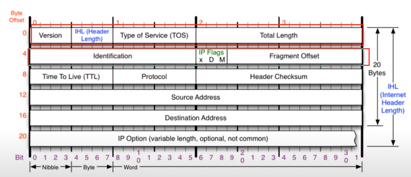
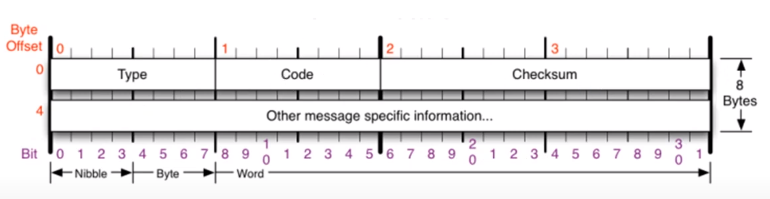
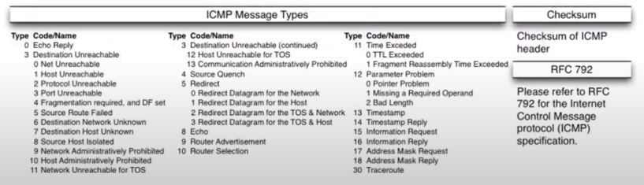
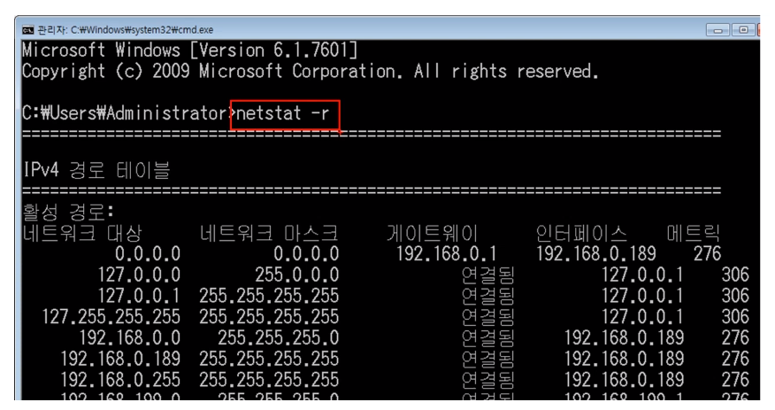
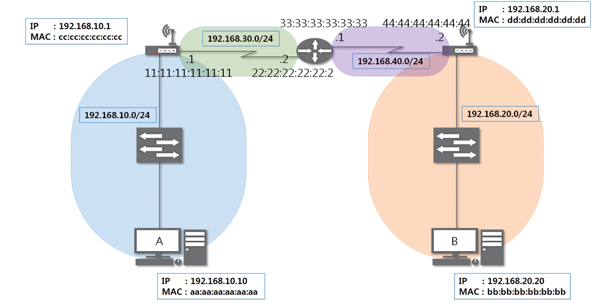
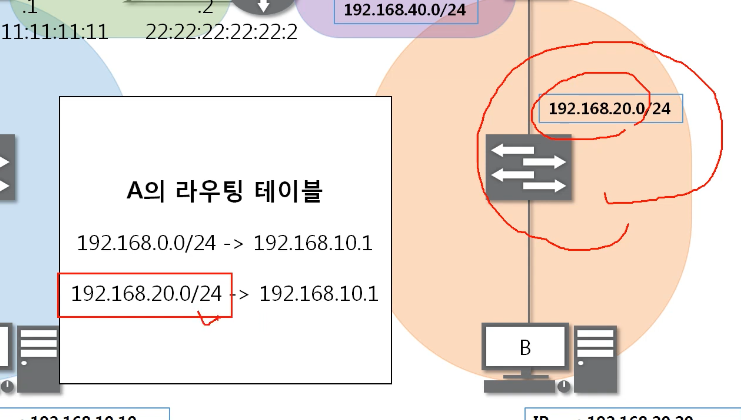
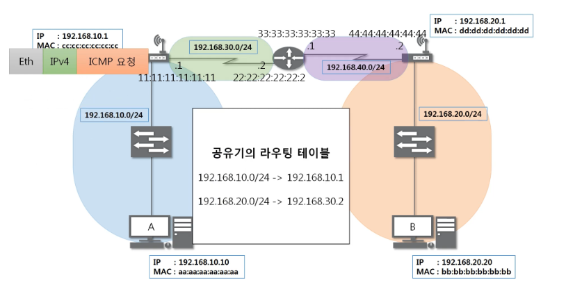
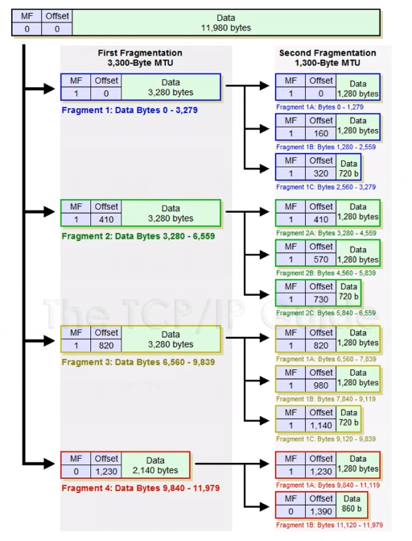
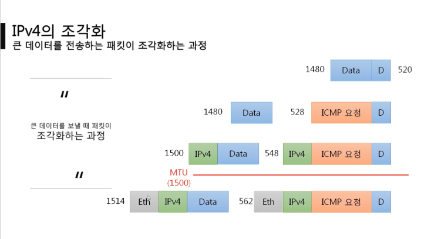
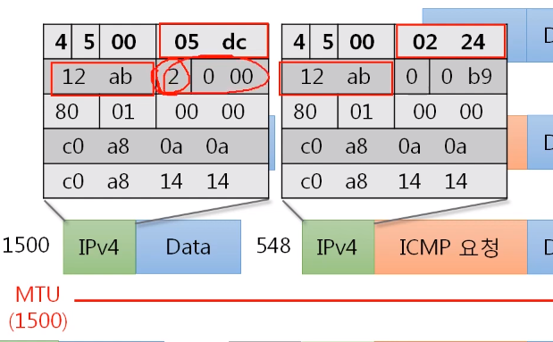

# 6장 - IP 프로토콜 주소

## IPv4 프로토콜

### IPv4가 하는 일

네트워크 상에서 데이터를 교환하기 위한 프로토콜

데이터가 **정확하게 전달될 것을 보장하지 않는다.**

중복된 패킷을 전달하거나 패킷의 순서를 잘못 전달할 가능성도 있다.

(악의적으로 이용되면 DoS 공격이 됨)

데이터의 정확하고 순차적인 전달은 그보다 상위 프로토콜인 TCP에서 보장한다.

### IPv4 프로토콜의 구조

#### 다른 네트워크의 특정 대상을 찾는 IPv4 프로토콜

---

## ICMP 프로토콜

### ICMP가 하는 일

ICMP (Internet Control Message Protocol, 인터넷 제어 메시지 프로토콜)

네트워크 컴퓨터 위에서 돌아가는 운영체제에서 **오류 메시지**를 전송받는 데 주로 쓰인다.

프로토콜 구조의 Type과 Code를 통해 오류 메시지를 전송 받는다.

### ICMP 프로토콜의 구조

#### 특정 대상과 내가 통신이 잘 되는지 확인하는 ICMP 프로토콜

- Type : 대분류
  - 8 : 요청
  - 0 : 응답
  - 3 : 경로상 문제
  - 11 : 상대방의 문제
  - 5 : 과거에 사용하던 것

- Code : 소분류

- 0, 8 : 기본적인 것
- 3, 11 : 뭔가 잘못되었다
- 5 : 보안상 알아두어야 한다

---

## 라우팅 테이블

### 내가 보낸 패킷은 어디로 가는가

#### 어디로 보내야 하는지 설정되어 있는 라우팅 테이블

확인하는 방법 : cmd에 netstat -r 명령어 입력

라우팅 테이블에 적혀있는 대역에만 찾아갈 수 있고 적혀있지 않은 대역에는 찾아갈 수 없다.

---

## 다른 네트워크와 통신 과정

### 다른 네트워크까지 내 패킷의 이동 과정

A컴퓨터가 다른 네트워크 대역에 있는 B컴퓨터와 통신하는 과정

이 그림에서의 네트워크 대역 : 4개

- A컴퓨터 - 공유기1
- 공유기1 - 라우터
- 라우터 - 공유기2
- 공유기2 - B컴퓨터

A의 라우팅 테이블에 B의 네트워크 대역이 있어야 통신이 가능하다.

1. 전달(패킷) : A -> 스위치 -> 공유기1

2. 공유기에서 목적지 IP 주소와 라우팅 테이블을 확인 후 Ethernet 프로토콜을 생성한다.
3. 라우터에서도 Ethernet 프로토콜과 IP 프로토콜을 확인한 후 IP 프로토콜의 목적지 MAC 주소와 자신의 라우팅 테이블을 확인하고, Ethernet 프로토콜 주소를 새로 작성한다.
4. 공유기 2가 패킷을 받고 IP 주소와 라우팅 테이블을 확인한 후 Ethernet 프로토콜을 생성한다.
5. 스위치에게 전달 -> B에게 전달.

---

## IPv4의 조각화

### 조각화란?

큰 IP 패킷들이 적은 **MTU**(Maximum Transmission Unit)를 갖는 링크를 통하여 전송되려면 **여러 개의 작은 패킷으로 쪼개어/조각화 되어 전송**돼야 한다.

즉, 목적지까지 패킷을 전달하는 과정에 통과하는 각 라우터마다 전송에 적합한 프레임으로 변환이 필요하다.

일단 조각화되면, 최종 목적지에 도달할 때까지 재조립되지 않는 것이 일반적이다.

IPv4에서는 발신지 뿐만 아니라 중간 라우터에서도 IP 조각화가 가능하다.

IPv6에서는 IP 단편화가 발신지에서만 가능하다.

재조립은 항상 최종 수신지에서만 가능하다.

#### 여러 개의 패킷으로 조각화 된 패킷

IPv4 프로토콜은 20byte이다.

11,980byte의 데이터를 최대 전송 단위(MTU) 3,300byte에 맞춰 잘게 쪼갠다.

IPv4 프로토콜까지 합친 값이 MTU 값이다.

- MF : Fragment가 더 있는지 표시
- Offset : 패킷이 기준점으로부터 떨어진 거리를 8로 나눈 값.

### 조각화하는 과정

#### 큰 데이터를 보낼 때 패킷이 조각화하는 과정

실제 전송되는 프레임은 1514byte이다.

4bit 단위로 자르고 16진수로 변환하면 2가 된다. 

ICMP는 마지막 패킷에만 붙으므로 실제 IPv4프로토콜에서 MF는 1이 아니라 2가 된다.